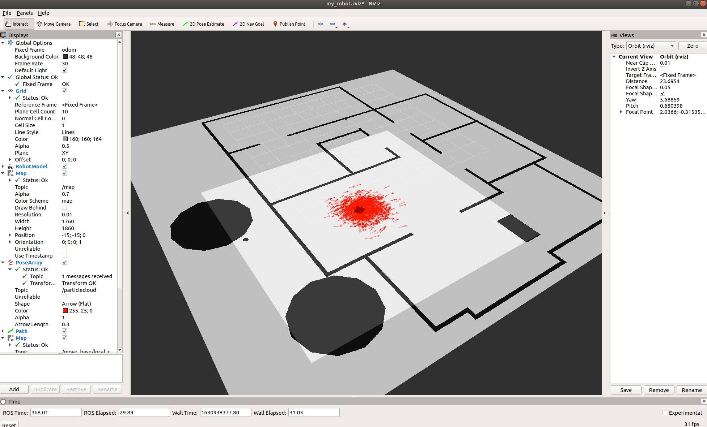
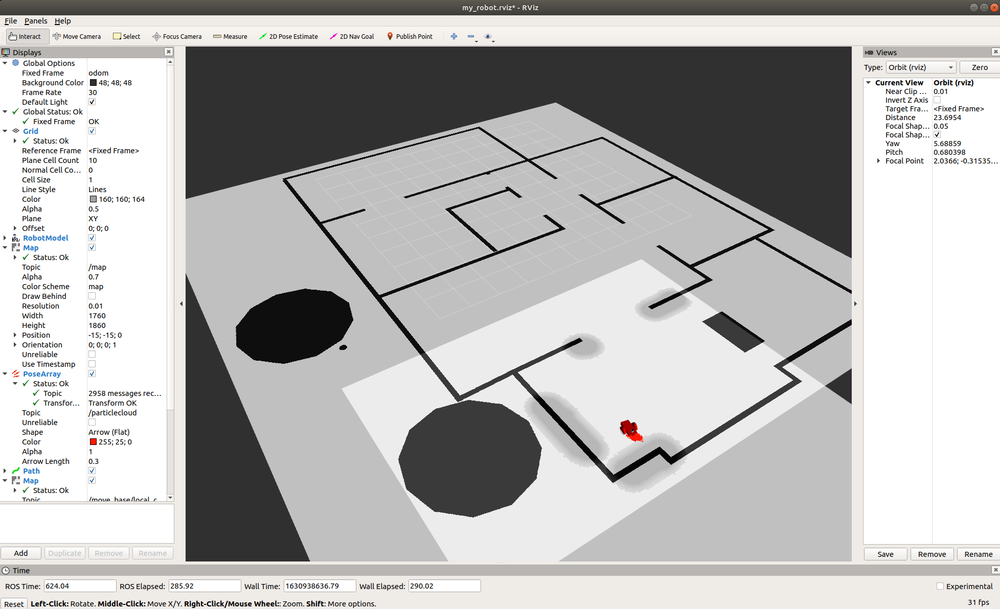
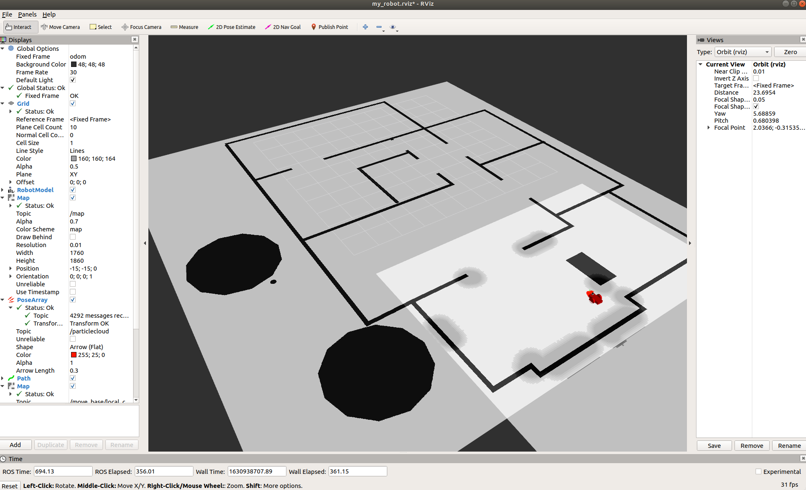

# Project 3: Where am I?

**Project Submission by Bill Webb**

**September 2021**

## Running the Project

To set up your python environment to run the code in this repository, follow the instructions below.  This was done on an Ubuntu target.

1. Source the ROS environment.

``` bash
source devel/setup.bash
```

2. Build the ROS project.

``` bash
catkin_make
```

3. Run ROS to start the world, Gazebo, and RVIZ.

``` bash
roslaunch my_robot world.launch
```

4. In the RVIZ GUI, load the config file `src/my_robot/rviz/my_robot.rviz`

5. In other terminal, source the environment and run map and AMCL.

``` bash
source devel/setup.bash
roslaunch my_robot amcl.launch
```

## Results

This project performs localization of the robot.  The following images show the robot in its initial state.  Then, the following two images show the robot localized after moving it around the room using `2D Nav Goal` is in RVIZ.






