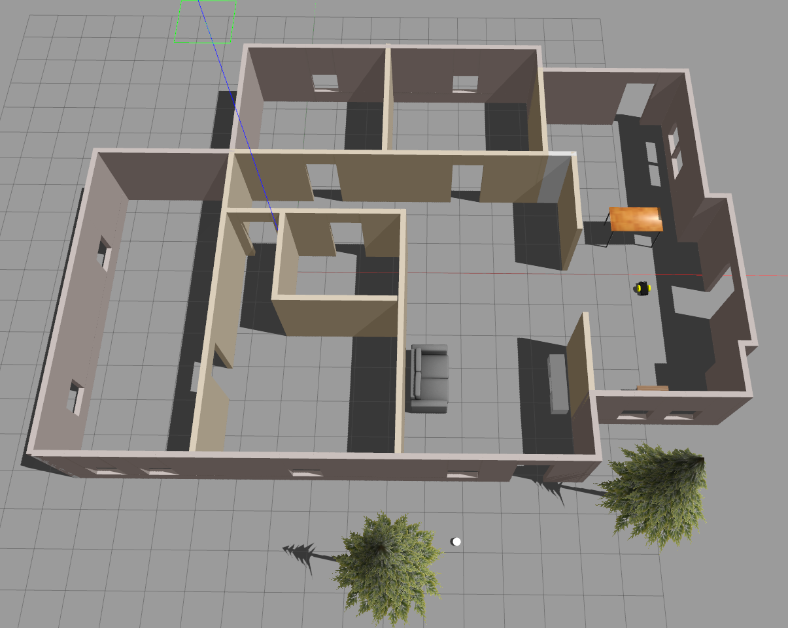
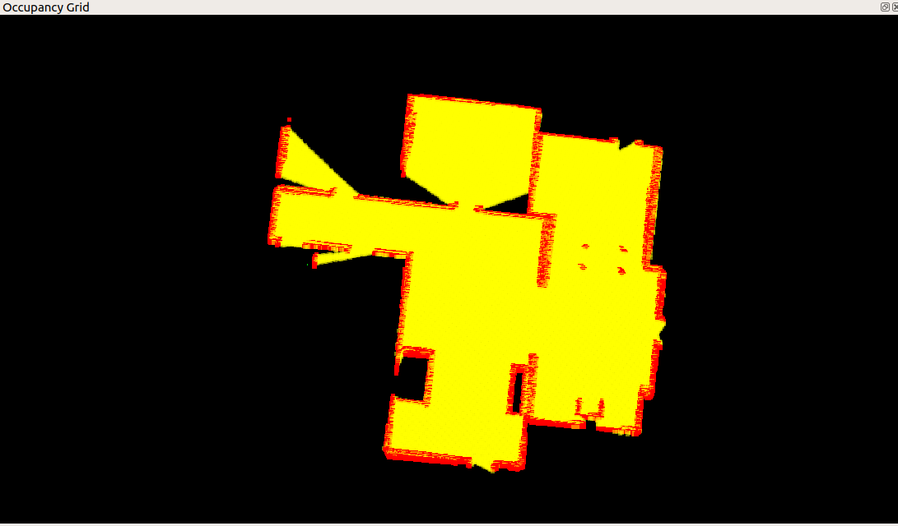

# Project 4: Map My World

**Project Submission by Bill Webb**

**July 2022**

## Running the Project

To set up your python environment to run the code in this repository, follow the instructions below.  This was done on an Ubuntu target.

1. Change to the Project 4 directory.

``` bash
cd robotics-nd/project-4-map-my-world
```

2. Source the ROS environment.

``` bash
source devel/setup.bash
```

3. Update the model path.

``` bash
export GAZEBO_MODEL_PATH=$GAZEBO_MODEL_PATH:$(pwd)/models/
```

4. Build the ROS project.

``` bash
catkin_make
```

5. Run ROS to start the world, Gazebo, and RVIZ.

``` bash
roslaunch my_robot world.launch
```

6. In another terminal, run teleop to control the robot.

``` bash
source devel/setup.bash
rosrun teleop_twist_keyboard teleop_twist_keyboard.py
```

7. In another terminal, run mapping.

``` bash
source devel/setup.bash
roslaunch my_robot mapping.launch
```

8. Drive around the world using teleop so mapping can be performed.

9. Localization can then also run.

``` bash
source devel/setup.bash
roslaunch my_robot localization.launch
```

## Results

The mapping was done in the two main rooms of the house.  The results included 48 global loop closures and an accurate occupancy grid.  It was necessary to add landmarks (sofa, desk, etc.) for the global loop closures to occur more often.

The rtabmap.db file can be downloaded from [this link](https://drive.google.com/file/d/1drIF_3gNQ0ZJ8WR44o6XhCkH5J2rPPhJ/view?usp=sharing).

### World Overview


### Graph View with 48 Global Loop Closures


### Occupancy Grid including Landmarks


### 3D Map

